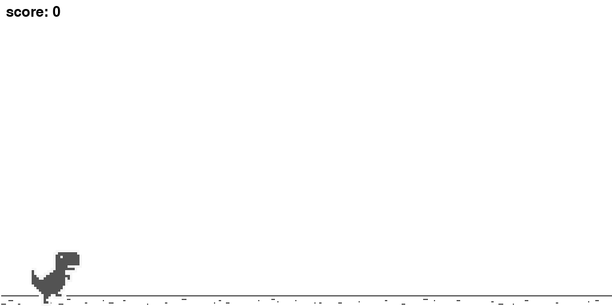
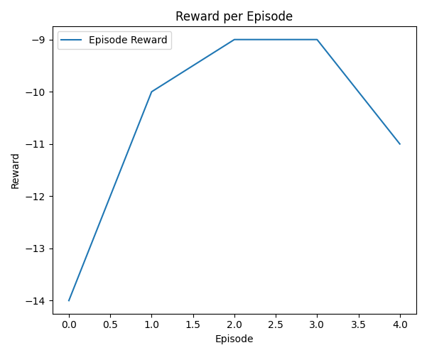
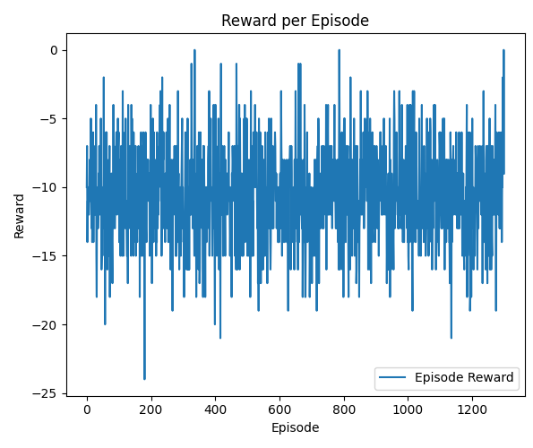
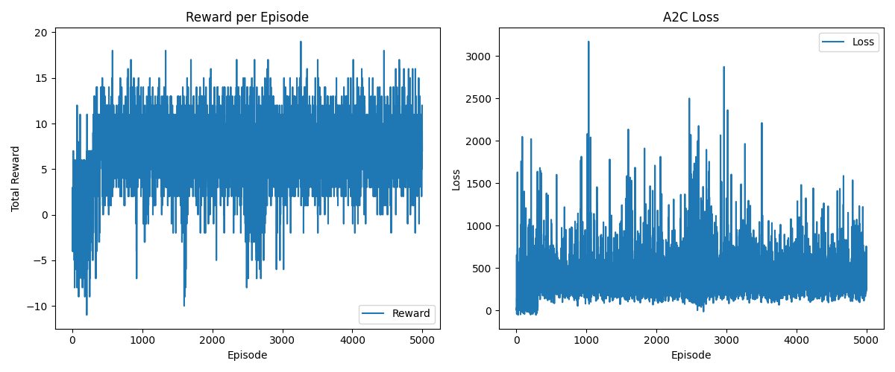
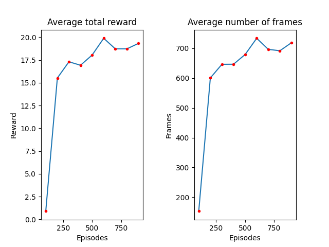

# RL-Project

# 🦖 Chrome Dinosaur RL - Apprentissage par Renforcement

Ce projet met en œuvre des algorithmes d'apprentissage par renforcement dans un environnement personnalisé inspiré du célèbre jeu **Dino Chrome** de Google. Le but est d'entraîner un agent à éviter les obstacles (cactus, oiseaux) en courant à travers un désert infini.

---

## 🎮 Présentation du Jeu

Le jeu consiste à contrôler un dinosaure qui court automatiquement dans un décor défilant. Il doit éviter des obstacles en **sautant** ou en **se baissant**. Le jeu s’accélère avec le temps, rendant la tâche de plus en plus difficile.

---

## 🏗️ Environnement d'entraînement

L’environnement a été construit avec :

- **Gymnasium** : pour la structure de l’environnement RL
- **Pygame** : pour l’affichage et la simulation 2D

### Actions possibles

- `0` : Rester debout
- `1` : Sauter
- `2` : Se baisser

### Observations

L’agent ne reçoit pas de vecteurs, mais une **observation visuelle (image RGB)**. Pour améliorer la perception du mouvement :

- Les **K dernières frames** sont empilées
- Redimensionnées et converties en **niveaux de gris**

---

## 🧠 Règles du jeu & Système de récompense

| Situation                    | Récompense |
| ---------------------------- | ---------- |
| Évite un obstacle            | `+1`       |
| Collision avec un obstacle   | `-1`       |
| Autres cas (course continue) | `0`        |

- Pendant l'entraînement, la collision **ne termine pas** l’épisode (pour un apprentissage continu)
- En mode évaluation, une collision **met fin** à l’épisode (comme dans le vrai jeu)

---

## 🎯 Objectif de l’apprentissage

L’agent apprend à **maximiser la récompense cumulative**, en évitant les obstacles aussi longtemps que possible.  
La **difficulté augmente** dynamiquement avec le temps (vitesse accrue).

---

## 🧪 Algorithmes Testés

### 🔄 PPO (Proximal Policy Optimization)

**Résultats initiaux :**

- L’agent PPO n’apprenait **aucune bonne politique** (récompenses négatives)
  
  
  **Améliorations apportées :**

1. 📐 Déduction automatique de la taille du `Linear` (évite erreurs de dimension)
2. 🎨 Normalisation des images (state / 255.0)
3. 🚫 Clipping des avantages (stabilité des updates)
4. 📊 Augmentation du poids de l’entropie (0.01 → 0.02) → exploration
5. 🔗 Utilisation de `.detach()` sur `next_state` pour éviter les calculs de gradients inutiles




---

### ⚡ A2C (Advantage Actor Critic)

**Pourquoi A2C ?**

- ✅ Simple, rapide, sans replay buffer
- ✅ Utilise un **critic** pour réduire la variance
- ✅ Bon pour des environnements visuellement complexes

**Structure :**

- **Actor** : Prédit les probabilités des actions
- **Critic** : Estime la valeur de l’état (`V(s)`)
- Fonction de perte :
  - `Loss_actor`
  - `Loss_critic`
  - `Entropy penalty`




---

### ✅ DQN (Deep Q-Network)



**Pourquoi DQN fonctionne le mieux ?**

- 🧠 Adapté à l’**espace d’actions discret**
- 💾 Utilise une **replay buffer** pour stocker les transitions et casser les corrélations temporelles
- 🔁 Intègre un **réseau cible** mis à jour moins fréquemment → stabilité accrue
- 🧩 Moins sensible aux **hyperparamètres**
- 🔎 Meilleure performance dans les environnements avec **récompenses clairsemées ou bruitées**

Dans notre expérimentation, nous avons également modifié les **paramètres de l’environnement**, notamment la **vitesse initiale** du jeu, en passant de `20` à `40`, afin de voir si cela impactait positivement l’apprentissage de l’agent. Malgré cette modification, les performances observées sont restées relativement **similaires**, ce qui montre la **robustesse** du DQN dans différents contextes de difficulté.

**DQN (vitesse=20)**

**DQN (vitesse=40)**


---

## 📊 Comparaison des Algorithmes

| Algorithme | ✅ Avantages                                       | ❌ Inconvénients                    |
| ---------- | -------------------------------------------------- | ----------------------------------- |
| **DQN**    | Robuste, simple, très adapté aux actions discrètes | Moins adapté aux actions continues  |
| **PPO**    | Adapté aux environnements complexes                | Sensible aux hyperparamètres        |
| **A2C**    | Rapide, simple, peu de complexité                  | Pas de replay buffer, plus instable |

---

## 🚀 Pour exécuter le projet

1. Cloner le dépôt :

```bash
git clone https://github.com/ton-utilisateur/chrome-dino-rl.git
cd chrome-dino-rl
```

2. Installer les dépendances :

```bash
pip install -r requirements.txt
```

3. Lancer un agent :

```bash
python play.py human #Pour lancer le jeu jouable avec le calvier
python play.py ai -m dqn.pth  # Pour lancer le jeu avec DQN pour avec la vitesse initial de l'env égale à 20
python play.py ai -m dqnv2.pth  # Pour lancer le jeu avec DQN pour avec la vitesse initial de l'env égale à 40
python play.py ai -m ppo.pth # Pour lancer le jeu avec PPO non optimisé pour avec la vitesse initial de l'env égale à 20
python play.py ai -m ppoSlowEnv.pth # Pour lancer le jeu avec PPO optimisé pour avec la vitesse initial de l'env égale à 20
python play.py ai -m ppov2.pth # Pour lancer le jeu avec PPO optimisé pour avec la vitesse initial de l'env égale à 40
python play.py ai -m a2c.pth  # Pour lancer le jeu avec A2C pour avec la vitesse initial de l'env égale à 20
python play.py ai -m a2cv2.pth  # Pour lancer le jeu avec A2C pour avec la vitesse initial de l'env égale à 40
```
---
**Sources:**
Lien vers l'environnement pygame : https://github.com/MaxRohowsky/chrome-dinosaur 